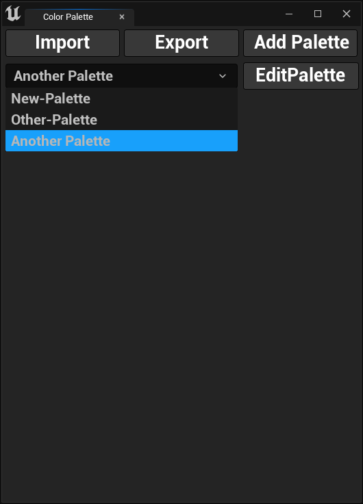
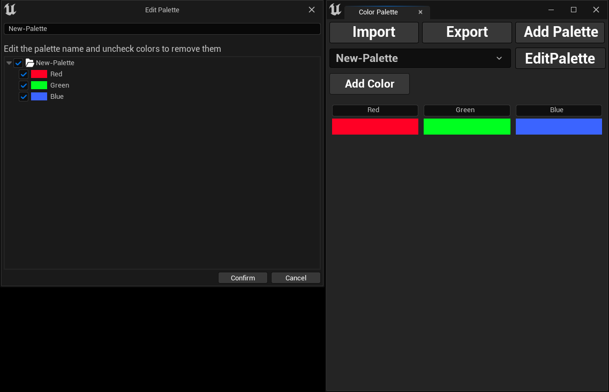

## Selecting Color Palette

To select a color palette, click on the drop-down menu and select a color palette as shown in the image below.

## Editing Color Palette

To edit a color palette, click the `Edit Palette` button. A new dialog box will open, allowing you to update the palette's 
name and remove colors by deselecting them from the list. When you're done, click `Confirm` to save your changes.

