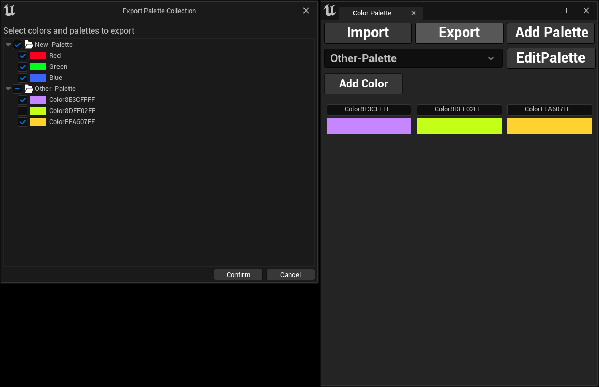

## Exporting Color Palettes

To share your color palettes across projects or with your team, you can easily export them by following these steps:

* 1- Click the `Export` button.
* 2- A file save dialog will appear, allowing you to choose where to save the exported palettes.
* 3- Set the file name and directory, then click `Save`.
* 4- A new dialog will open, letting you select specific palettes and colors to export.
* 5- Finally, click `Confirm`, and your selected palettes and colors will be saved to the chosen file.

