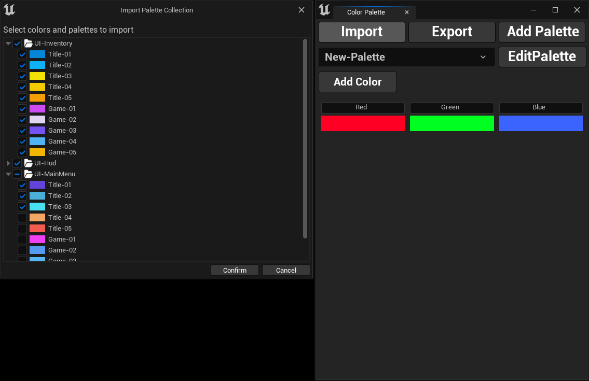

## Importing Color Palettes

To import color palettes from other projects or team members, follow these steps:

* 1- Click the `Import` button.
* 2- A file dialog will open, allowing you to select the *JSON* file containing the color palettes.
* 3- Once selected, a new dialog will appear where you can choose specific palettes and colors from the imported file.
* 4- Click `Confirm` to complete the import, and your selected palettes and colors will be added to your project.

:::warning
You can only import files that were exported using this plugin. Attempting to import any JSON file will result in an empty import dialog and the import will fail.
:::

