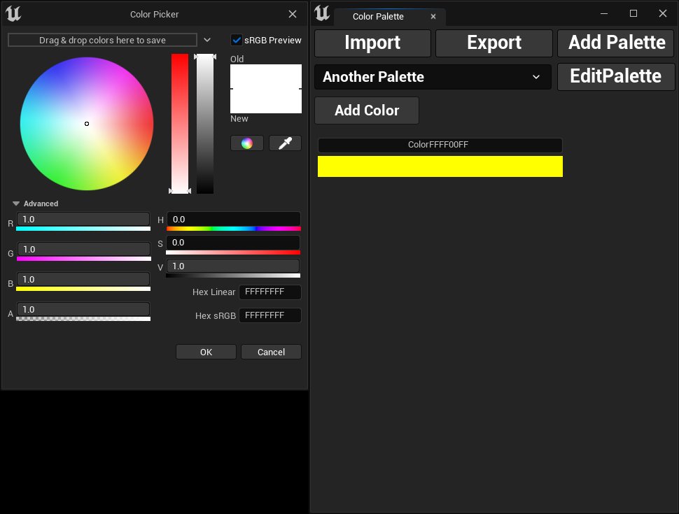

## Adding Colors to Palette

To add a new color, simply click the `Add Color` button. A color picker window will open allowing you to choose your 
desired color. Once you've made your selection, click `OK` to add it to the palette.

By default, the selected color will be named using its hex linear color code, prefixed with the word *Color*.
Example: `ColorFFFF00FF`

