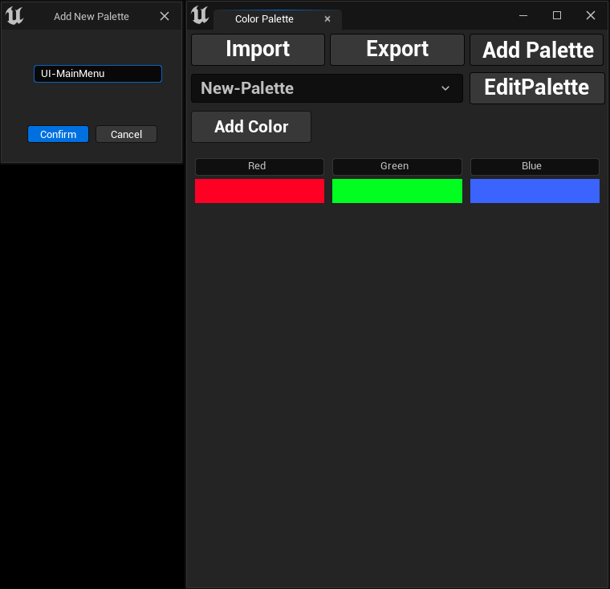

## Adding New Color Palette

To add a new color palette, simply click the `Add Palette` button. A new dialog box will open where you can enter a title 
for your new palette. Once you've named it, click `Confirm` to create your color palette!

:::info
If you provide a color palette name that already exists, the color palette won't be created.
:::

