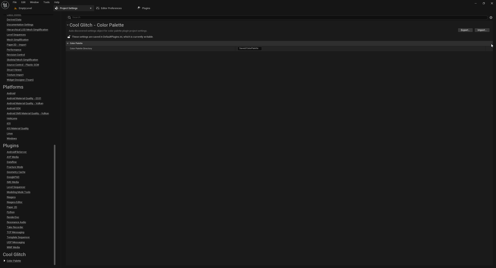

## Plugin Settings

`Color Palette` plugin allows you to specify the directory that will be created under 'Project' directory to save color palette files. 

You can set the directory by going to `Project Settings` -> `Cool Glitch | Color Palette` -> `Color Palette Directory`.

